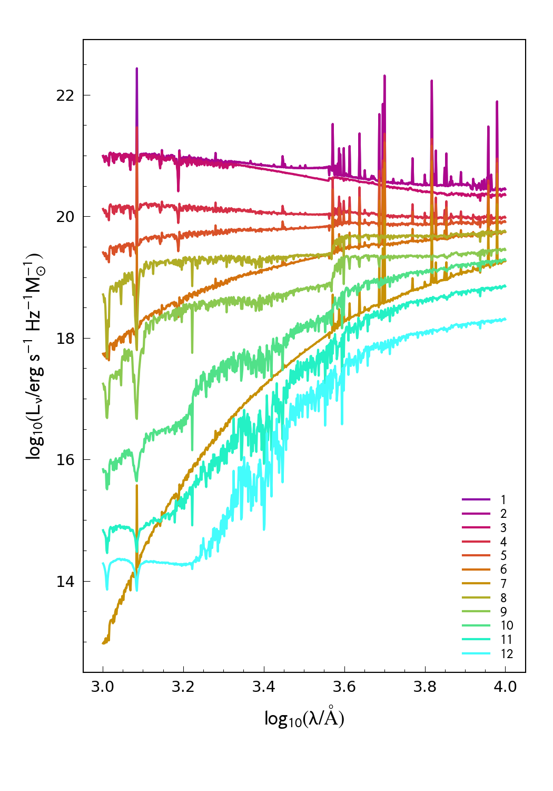

# Synthesizer EAZY Templates

NOTE: This is still very much a work in progress!

This module contains a new set of templates for [EAZY](https://github.com/gbrammer/eazy-photoz/). These are generated using (currently a branch of) [Synthesizer](https://github.com/flaresimulations/synthesizer), a package developed to produce synthetic observations for galaxy formation simulations.

The philosophy behind these templates is:

- constructed using a single stellar population synthesis model.
- constructed using simple star formation histories, including bursts (instantaneous star formation), and periods of constant star formation.
- consistent modelling of nebular emission.
- including age so only templates consistent with the age of the Universe are fit at a given redshift.
- (ultimately) available for a range stellar population synthesis models and initial mass functions.

## Description of individual templates

| Template Number | SFH | $f_{\rm esc}$ | $f_{\rm esc, Ly-\alpha}$ | $\tau_{V}$ | Notes |
| --- | --- | --- | --- | --- | --- |
| 1  | 10 Myr Constant  | 0.0 | 1.0 | 0.0 | |
| 2  | 10 Myr Constant  | 0.0 | 0.0 | 0.0 | No Lyman- $\alpha$ |
| 3  | 10 Myr Constant  | 1.0 | N/A | 0.0 | |
| 4  | 100 Myr Constant  | 0.0 | 1.0 | 0.0 | |
| 5  | 100 Myr Constant  | 0.0 | 1.0 | 0.3 | |
| 6  | 100 Myr Constant  | 0.0 | 1.0 | 1.0 | |
| 7  | 100 Myr Constant  | 0.0 | 1.0 | 3.0 | |
| 8  | 100 Myr Burst | 1.0 | N/A | 0.0 | |
| 9  | 316 Myr Burst | 1.0 | N/A | 0.0 | |
| 10 | 1000 Myr Burst | 1.0 | N/A | 0.0 | |
| 11 | 3162 Myr Burst | 1.0 | N/A | 0.0 | |
| 12 | 10000 Myr Burst | 1.0 | N/A | 0.0 | |

## Available SPS models and initial mass function

At present templates for only one SPS/IMF combination are available, however we plan to add new templates generated using FSPS, BC03, Pegase.2, etc. as soon as possible.

| Population Synthesis Model | Version | Initial Mass Function | Upper Mass Limit |
| --- | --- | --- | --- |
| BPASS | 2.2.1-binary | Chabrier | 100 |

## Plots

### BPASS 2.2.1-binary Chabrier 100

### tweak_fsps_QSF_12_v3

The popular tweak_fsps_QSF_12_v3 template set.

